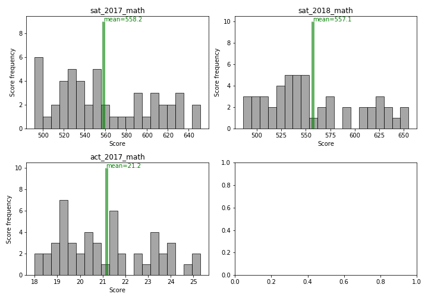
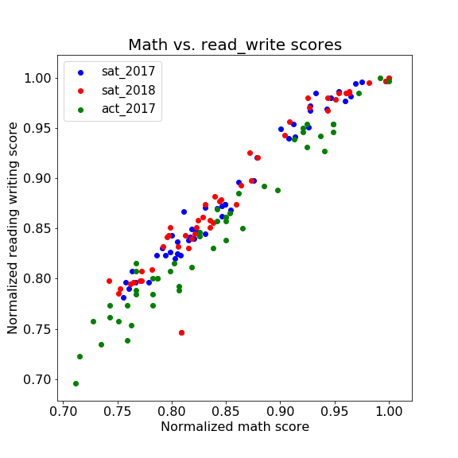

### Objective

To identify trends in participation and also scores in state-based datasets for SAT and ACT scores in years 2017-2019.

---

### Datasets

- [2017 SAT Scores](./data/sat_2017.csv)
- [2017 ACT Scores](./data/act_2017.csv)
- [2018 SAT Scores](./data/sat_2018.csv)
- [2018 ACT Scores](./data/act_2018.csv)
- [2019 SAT Scores](./data/sat_2019.csv)
- [2019 ACT Scores](./data/act_2019.csv)

These data give average SAT and ACT scores by state, as well as participation rates for the classes of 2017, 2018, and 2019.

### <span style="color: green">Project structure
    
The import, data process, as well as modeling and visualizatons were all performed in python. The project directory is structured as follows:
```
project-global_warming_NLP
    
|__ a_data/
|__ b_codes/
|   |__ P01_API_requests.ipynb  
|   |__ P02_data_cleaning.ipynb 
|   |__ P03_EDA_nlp.ipynb   
|   |__ P04-Modeling.ipynb
|   |__ P05-Select_Model_Analysis.ipynb
|   |__ P06-Select_model_production.ipynb    
|__ c_plots/
|__ Executive_slides_NLP_reddit.pdf
|__ README.md
```

The project was first run on a small dataset of only 50 imported posts, at the production stage, it was run on 20,000 posts.

---

### <span style="color: green">Final cleaned DataFrame   
  

The cleaned Dataframe has the following format:

- #### <font color='blue'> df_final</font> is a pandas dataframe. Its entries are: 

|Feature|Type|Dataset|Description|
|---|---|---|---|
|**state**|*object*|sat_2017|The states where the sat exam was taken.|
|**sat_2017_participation**|*float*|sat_2017|The sat participation in units of percentage|
|**sat_2017_read_write**|*integer*|sat_2017|The sat grades for reading and writing|
|**sat_2017_math**|*integer*|sat_2017|The sat grades for math|
|**sat_2017_total**|*integer*|sat_2017|The total sat grades|
|**act_2017_participation**|*float*|act_2017|The act participation in units of percentage|
|**act_2017_english**|*float*|act_2017|The act grades for english|
|**act_2017_math**|*float*|act_2017|The act grades for math|
|**act_2017_reading**|*float*|act_2017|The act grades for reading|
|**act_2017_science**|*float*|act_2017|The act grades for science|
|**act_2017_composite**|*float*|act_2017|The act composite grades|
|**sat_2018_participation**|*float*|sat_2018|The sat participation in units of percentage|
|**sat_2018_read_write**|*integer*|sat_2018|The sat grades for reading and writing|
|**sat_2018_math**|*integer*|sat_2018|The sat grades for math|
|**sat_2018_total**|*integer*|sat_2018|The total sat grades|
|**act_2018_participation**|*float*|act_2018|The act participation in units of percentage|
|**act_2018_composite**|*float*|act_2018|The act composite grades|
=======

### <span style="color: green">EDA results  
    
<div style="text-align:center"></div>


<div style="text-align:center"></div>

    
    
    
### <span style="color: green">Recommendations   
    
    
- It is crucial to focus on reading as much as on math skills.

- This importance is being shared between SAT and ACT outcomes.

- As participation is historic, if the board does not pay attention to low participations, history will repeat itself.
